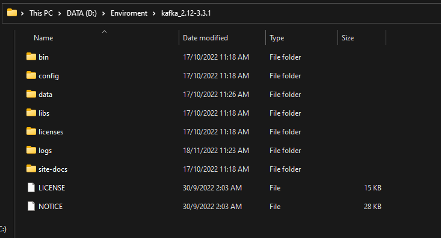

# Product management service

## 1. Objective:

###### - This service will show you the basic of spring batch.
###### - Its business is to handle product order requests from customers by kafka, then spring batch will read data from kafka topic and save it to the database.

## 2. How to run it:
###### - Go to "src/main/resources/database.sql" to copy sql query and run to create table.
###### - Run kafka:
###### If you are using macOS, then go to https://kafka.apache.org/quickstart to follow instructions
###### If you are using window, then follow the below steps to run kafka
###### + Install kafka: https://kafka.apache.org/downloads
###### + Run kafka zookeeper: 
###### . Go to set-up folder

###### . Then head to this path "kafka_2.12-3.3.1\bin\windows" and open terminal console at this folder
###### . After opening terminal, type this cmd and run "zookeeper-server-start.bat ..\\..\config\zookeeper.properties" to run zookeeper.
###### + Run kafka server: 
###### . Open terminal at the same folder and run "kafka-server-start.bat ..\\..\config\server.properties"

###### - Run app: after running app, kafka topic will be created automatically, our kafka topic name is "".
###### - Go to the same kafka folder as above, then open terminal and run this cmd "kafka-topics.bat --describe --topic kafka-product-order-new --bootstrap-server localhost:9092" to check if topic is created.
###### - Send request to api "http://localhost:8080/send" with the request sample body: 
######    {
    "productName": "Nike",
    "numbersOfProduct": 5
}
###### - Go to the same kafka folder as above, then open terminal and run this cmd "kafka-console-consumer.bat --topic kafka-product-order-new --from-beginning --bootstrap-server localhost:9092" to check if topic received new data.
###### - If the data is inserted successfully to kafka topic, then go to database to check if data is copied to "product_order" table successfully.

